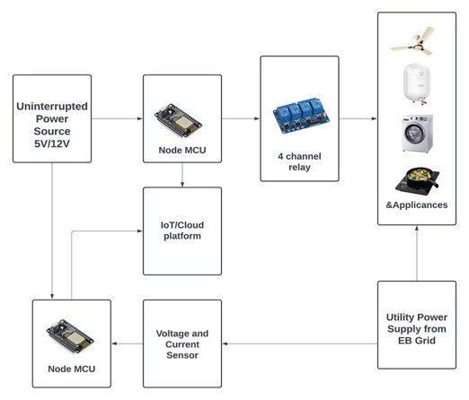
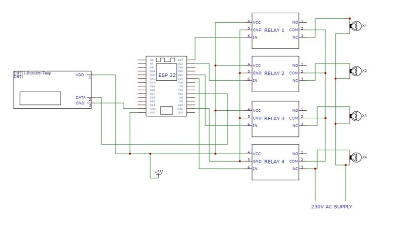

# IoT Enhanced Load Management for Optimal Energy Utilization

An IoT-based smart energy management system built using an **ESP32 microcontroller**.  
It allows users to remotely monitor and control electrical loads based on **temperature**, **real-time clock**, and **manual commands**, all through the **Blynk IoT platform**.

---

## 🚀 Features
- Remote control of electrical appliances using **Blynk IoT app**
- **Manual**, **Temperature-based**, and **Time-based** load control
- Real-time monitoring of energy usage
- Automatic scheduling during off-peak hours
- Promotes **energy efficiency** and **cost savings**

---

## ⚙️ Hardware Used
- **ESP32 Development Board**
- **DHT11 Temperature Sensor**
- **DS3231 Real-Time Clock (RTC) Module**
- **4-Channel Relay Module**
- **Wi-Fi Connection**
- **Load Devices** (Bulbs, Fans, etc.)

---

## 💻 Software Used
- **Arduino IDE**
- **Blynk IoT Platform**

### Required Libraries
```cpp
#include <WiFi.h>
#include <BlynkSimpleEsp32.h>
#include <DHT.h>
```

---

## 🔧 Working Principle
1. ESP32 connects to the **Blynk Cloud** via Wi-Fi.
2. Users control relays manually through the Blynk mobile app.
3. **Temperature-based automation** turns on a relay when the ambient temperature exceeds a set threshold.
4. **RTC-based automation** switches relays on/off at predefined times.
5. All control modes (manual, temperature, RTC) work simultaneously for real-time operation.

---

## 📊 Results
- Successful **remote operation** of multiple electrical loads.
- **Automatic switching** based on temperature and time.
- Demonstrated **energy-efficient load management** using IoT.

---

## 🧠 Future Enhancements
- Integration with **AI-based load prediction**
- **Voice assistant** support (Google Assistant / Alexa)
- **Energy analytics dashboard** for data visualization
- Support for **multiple device groups**

---

## 📁 Project Structure
```
IoT-Enhanced-Load-Management/
├── README.md
├── /Code
│   └── main.ino
├── /Hardware
│   ├── Circuit_Diagram.png
│   ├── Block_Diagram.png
│   └── Components_List.txt
└── /Demo
    └── Output_Video.mp4
```

---

## 🧾 Team Members (of PSG COLLEGE OF TECHNOLOGY)
- **Jayakrishnaa S** – 21E908  
- **Kani Brama Giri S** – 21E911  
- **Kovarthanan K** – 21E914  
- **Palaparthi Tarun** – 21E918  
- **Subash A** – 21E922  

---

## 📚 References
- [Blynk IoT Platform](https://blynk.io/)
- [ESP32 Documentation](https://docs.espressif.com/)
- [DHT Sensor Library](https://github.com/adafruit/DHT-sensor-library)

  ## 🔲 Block Diagram


## ⚡ Circuit Diagram


## Result


## 🎬 Project Demo
[▶️ Watch the Demo Video](docs/README-image/Media1.mp4)


